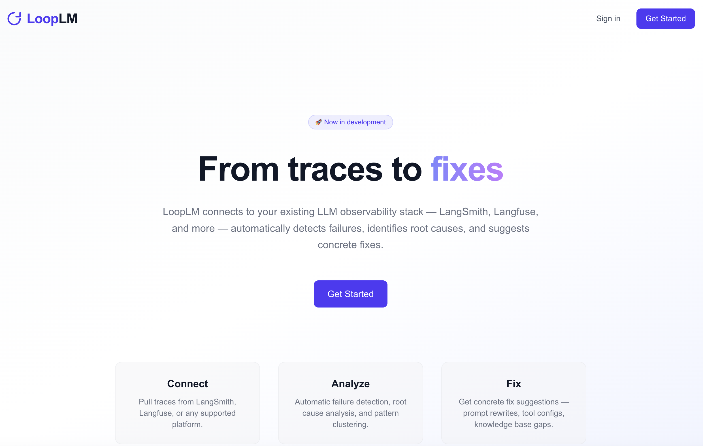
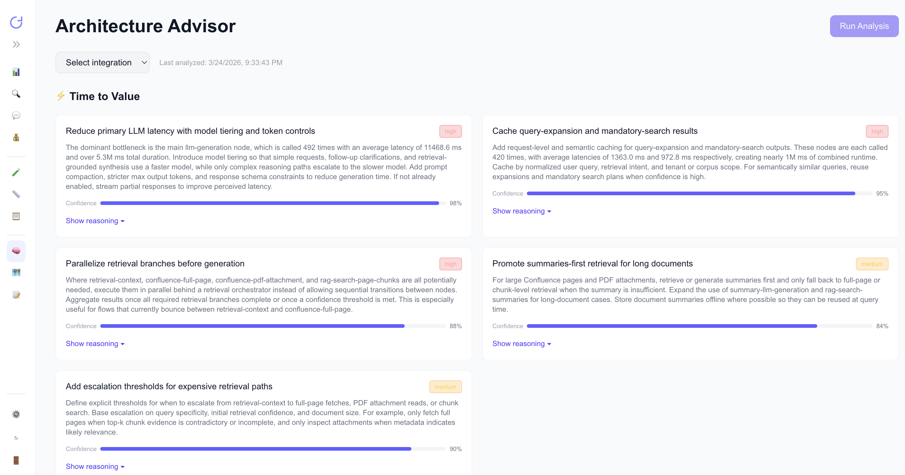
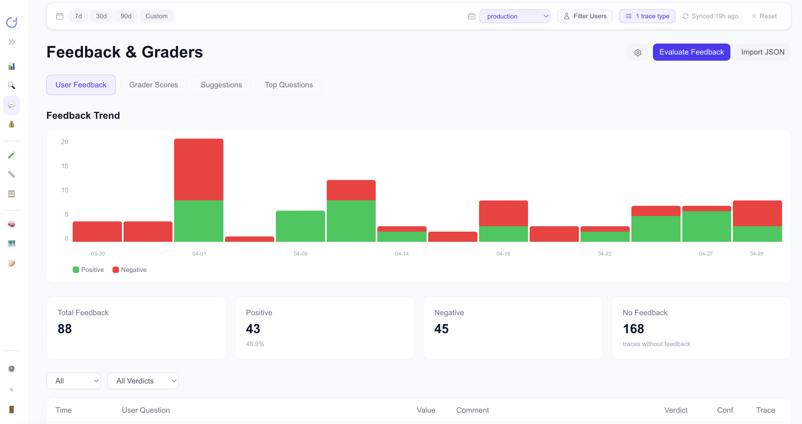
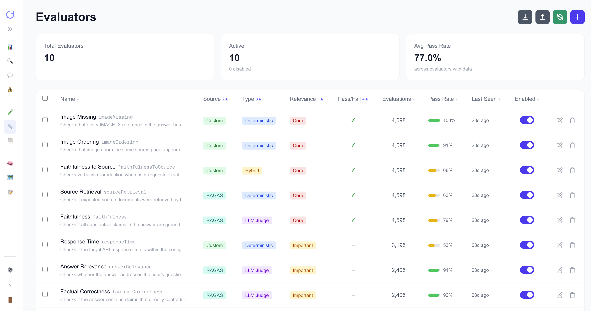

# LoopLM

[](LICENSE)
[](https://nodejs.org)
[](https://www.python.org)

**From traces to fixes.** LoopLM is an open-source LLMOps layer that connects to your existing observability stack, finds where your LLM application is failing, and helps you get from a failure to a concrete fix.



## Why

Most LLMOps tools today are built for engineers debugging systems. They expose traces, spans, and tokens at a level of detail that makes sense to the person who shipped the code, and almost no sense to the people who own whether the AI feature is actually doing its job: product managers, domain experts, customer success, compliance.

In practice, this means evaluation tends to fall back to engineers running ad-hoc scripts when something visibly breaks, while the people closest to the use case have no agency in defining what "good" looks like or maintaining the test datasets that decide it. Drift goes unnoticed until a customer complains.

LoopLM is built around a different assumption: evaluation should be a cross-functional workflow. Product people generate and curate test datasets, define quality criteria in domain terms, and review failures alongside engineers. Engineers get the deeper trace and root-cause tooling they need. Both views look at the same underlying data.

## How it works

LoopLM connects to the observability stack you already have. Pre-built connectors ingest traces, spans, and threads from Langfuse and LangSmith without requiring any change to your application code or instrumentation. From there, LoopLM analyzes failure patterns, surfaces root causes, and suggests concrete fixes.

**Architecture Advisor** identifies bottlenecks and recommends specific changes with confidence scoring and reasoning.



**Feedback and Graders** combines human feedback signals with automated graders, designed for cross-functional review rather than engineer-only workflows.



**Evaluators** support deterministic checks, LLM-as-judge graders, and hybrid evaluators, with first-class support for RAGAS metrics alongside custom criteria defined per use case.



## Coming soon

**Suggested test cases.** Traces with feedback become candidate test cases automatically. A reviewer — PM, domain expert, or engineer — approves or edits each one before it's added to an existing dataset. This closes the loop from "this output was bad" to "we'll catch this in the next eval run," without leaving dataset curation to whoever happens to be on call.

---

Self-hosted by default, because the teams I'm building this for can't send prompts to a third party.

## Architecture

```text
LangSmith / Langfuse / other sources
                |
                v
      Python connector layer
                |
                v
 FastAPI API + PostgreSQL + Redis
                |
                v
        Next.js frontend
```

## Quick Start

### Prerequisites

- Docker and Docker Compose
- Node.js 20+
- pnpm 9+
- Python 3.12+
- Poetry

### Docker Compose (single host)

```bash
cp .env.example .env
make secrets        # generates API_SECRET_KEY, POSTGRES_PASSWORD, REDIS_PASSWORD - paste into .env
docker compose up --build
```

Services:

- Frontend: `http://localhost:3000`
- API: reachable through the frontend at `/api/*` (not published on the host)
- API docs: set `DOCS_ENABLED=true` in `.env`, then `http://localhost:3000/api/docs`

Every port is bound to `127.0.0.1`. Docker's port publishing writes iptables rules that bypass
`ufw`/`firewalld`, so binding the database to `0.0.0.0` on a cloud VM exposes it to the internet.
For direct host access to Postgres or Redis while developing, copy
`docker-compose.override.yml.example` to `docker-compose.override.yml`.

### Running it on a server

This compose file is not a production deployment on its own. Before exposing an instance:

- Terminate TLS in a reverse proxy in front of the frontend. Bearer tokens travel in headers and
  the compose stack speaks plain HTTP.
- Leave `DEBUG=false`. Debug mode returns exception messages and tracebacks to clients and echoes
  every SQL statement, including bound parameters, to the log.
- Set every secret in the generated block, and keep `DOCS_ENABLED=false`.
- Do not publish `5432`, `6379` or `8000` on a public interface.
- Read [SECURITY.md](SECURITY.md).

### Local Development

1. Install workspace dependencies:

```bash
pnpm install
cd apps/api
poetry install --with dev
cd ../..
```

2. Copy the example environment and adjust values as needed:

```bash
cp .env.example .env
```

3. Start local infrastructure:

```bash
make infra
```

4. Run the API and web app in separate terminals:

```bash
make api
make web
```

Local URLs:

- Frontend: `http://localhost:3100`
- API: `http://localhost:8000`

Stop everything with:

```bash
make stop
```

### Manual Start

Backend:

```bash
cd apps/api
poetry install --with dev
poetry run uvicorn app.main:app --reload --host 0.0.0.0 --port 8000
```

Frontend:

```bash
pnpm install
cd apps/web
pnpm dev
```

## Configuration

Copy `.env.example` to `.env`. The most important settings are:

- `API_SECRET_KEY`: required outside debug mode
- `DATABASE_URL`, `REDIS_URL`: backend infrastructure
- `NEXT_PUBLIC_API_URL`: frontend API origin
- `ANALYSIS_LLM_PROVIDER`: `openai` or `azure_openai`
- `OPENAI_API_KEY` or `AZURE_OPENAI_*`: analysis/evaluator provider credentials
- `LANGFUSE_*`, `LANGSMITH_API_KEY`, `LANGCHAIN_*`: connector credentials
- `EVAL_TARGET_ENDPOINT`: target application endpoint for running evals

Optional frontend metadata:

- `NEXT_PUBLIC_REPOSITORY_URL`: public repository link shown on the landing page

## Development Notes

- `make api` uses `poetry run uvicorn`
- `make web` starts the Next.js app on port `3100`
- Alembic is available under `apps/api/alembic`
- The app still accepts legacy eval and dataset import formats for backwards compatibility

## Quality Checks

From the repo root:

```bash
pnpm lint
pnpm typecheck
pnpm build
```

For the API:

```bash
cd apps/api
poetry run ruff check .
poetry run pytest
```

## Project Structure

```text
apps/
  api/         FastAPI backend
  web/         Next.js frontend
connectors/    Provider connectors
packages/      Shared TypeScript packages
infra/         Dockerfiles and OpenTofu modules
scripts/       Seed and smoke-test helpers
```

## Open Source Notes

- The repo is intended for self-hosting today
- Legacy import compatibility is preserved, but new defaults are product-agnostic
- Secrets are not committed; use `.env.example` as the starting point for local setup

## License

MIT

## Contributing

See `CONTRIBUTING.md`.

## Security

Report security issues to `timtreskatis@gmail.com` or see `SECURITY.md`.
